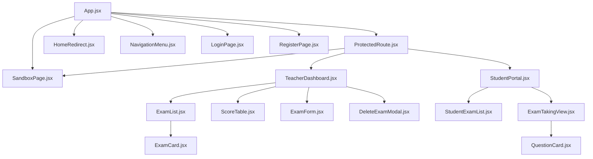
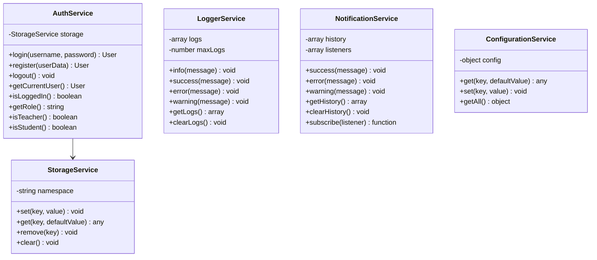
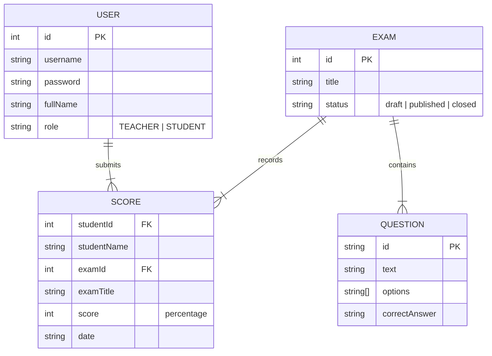
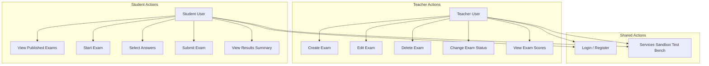

# ExamApp Specification

## Project Goal
Online examination system where teachers create and manage exams, and students take them with instant grading.

## Tech Stack
- React 19 + Vite 8
- React Router 6 (`react-router-dom` using HashRouter)
- Bootstrap 5.3
- Vitest + jsdom (testing)
- Mock API layer (simulated async services)
- Deployment: GitHub Pages

## Users
| Role    | Capabilities                                      |
|---------|---------------------------------------------------|
| Teacher | Create/edit/delete exams, view scores, set status  |
| Student | Browse exams, take quizzes, view results           |

## Routing Schema (HashRouter)
All routes are managed under `HashRouter` to prevent reload 404s on GitHub Pages:
- `/` — redirects authenticated users to their correct workspace; redirects unauthenticated users to `/login`.
- `/login` — login form, demo credentials, redirects active sessions back to `/`.
- `/register` — user registration with role selection, redirects active sessions back to `/`.
- `/teacher` [PROTECTED] — dashboard for teachers to manage exams and view logs.
- `/student` [PROTECTED] — portal for students to take exams.
- `/sandbox` [PROTECTED] — sandbox test bench to verify generic services.
- `*` (Wildcard) — redirects to `/`.

## Auth & Navigation Flow
- Authentication managed through the `AuthService` and persistent in local storage under prefix-namespaced key.
- Custom `ProtectedRoute` intercepts navigation requests, routing unauthenticated traffic to `/login`, and mismatches to their corresponding home routes.
- A dynamic `NavigationMenu` component renders responsive links matched to the active role (`TEACHER` or `STUDENT`) with user profile indicators and a logout redirect action.

## Teacher Dashboard Workspace
Refactored into a highly modular, decoupled structure:
- `TeacherDashboard.jsx` — orchestrates active view state, manages loaders, and executes `NotificationService` callback notifications. Manages create, edit, and delete flows.
- `ExamList.jsx` — grid layout component that takes list elements and maps them. Passes edit and delete callback handlers.
- `ExamCard.jsx` — visual cards that represent unique assessment metadata (title, questions length, status badges), button triggers for exam records lookups, and action triggers for edit and delete flows.
- `ScoreTable.jsx` — details panel holding student grade grids with loaders, closing handlers, and empty state support.
- `ExamForm.jsx` — form component managing inputs for exam title and dynamic questions list with options and correct answers, including full client-side validations.
- `DeleteExamModal.jsx` — deletion confirmation modal.

## Student Portal Workspace
Refactored into a modular, component-driven architecture:
- `StudentPortal.jsx` — mounts and fetches all exams on load using `getAllExams()`, filters list to published exams, and handles view state.
- `StudentExamList.jsx` — renders grid/list of published exams and triggers the callback to start a selected exam.
- `ExamTakingView.jsx` — renders the active assessment view with list of questions, exit controls, validation block, and final results view.
- `QuestionCard.jsx` — renders a single multiple-choice question with option interactions, active selections, and final correctness highlight states.

## Diagrams & Flows

### Components Hierarchy

### UML for Services

### Mock DB Schema

### Use Case Diagram

## Architecture & Generic Services
Modular, decoupled, and OOP-oriented structure:
- `mockDb.js` — in-memory data store (users, exams, scores)
- `userService.js` — async user auth operations with simulated delay
- `examService.js` — async exam CRUD wrappers with simulated delay
- `StorageService.js` — OOP localStorage wrapper with prefix namespacing and JSON support
- `AuthService.js` — OOP auth logic (login, register, logout, role checks)
- `LoggerService.js` — OOP FIFO logger storing at most the last 10 logs
- `NotificationService.js` — OOP alerts listener and activities history tracker
- `ConfigurationService.js` — OOP key-value configuration overrides engine

### Reusability
The services (`StorageService`, `LoggerService`, `NotificationService`, `ConfigurationService`) contain zero domain-specific references, allowing drop-in application inside any future client-side modules or other standalone web projects.

## Exam Status Management
An exam is in one of three states:
- `draft`: hidden from students.
- `published`: visible and startable by students.
- `closed`: visible on the teacher dashboard, but students cannot start or submit it.

The status is stored as a `status` string attribute in the mock DB. Changing the status dropdown in the teacher dashboard triggers `updateExam(id, { status: newStatus })`, notifying and logging the transition. The student portal fetches latest exam data on fetch and submission, rejecting non-published exams with proper error notifications and action logging.

## Exam Submission & Score Saving
Upon clicking "Submit Assessment":
- Score percentage is calculated based on correct answers.
- User profile info is retrieved from `AuthService`.
- A score record containing `studentId`, `studentName`, `examId`, `examTitle`, `score` (percentage), and `date` is saved to the mock database via `examService.saveScore(scoreRecord)`.
- Correct and incorrect options are highlighted on screen for student review.
- The new score record can be retrieved and viewed by the teacher later using `examService.getScoresByExam(examId)`.

## Testing & Validation
Unit and component tests execute in Vitest with a browser-like `jsdom` environment:
- **Auth tests**: login success/fail, register success/duplicate/validation, logout, getCurrentUser, role checks
- **Services tests**: Storage serialization/defaults/prefixes, Logger FIFO log buffer, Notification publishers/history/categories, Configuration runtime overrides
- **Routing & Component tests**: dynamic Navigation menu rendering, teacher/student links assertion, ProtectedRoute boundary blocks, and redirection handling
- **Teacher Dashboard tests**: loader triggers validation, mock exams binding verification, view grades API checks, and notification failures intercept testing
- **Exam CRUD tests**: create exam calls service with correct data, edit exam updates exam, delete exam removes exam, validation prevents empty title/question
- **Exam Status tests**: teacher can change status, student only sees published exams, closed exam blocks submission, draft exam is hidden from student
- **Student Exam List & Taking tests**: student page shows only published exams, student can start an exam, question options render correctly, submit is disabled until all questions answered

## Development Workflow
- Feature branches created from `dev`
- One commit per module/feature
- Comments committed separately
- Merge to `dev` via PR, deploy from `dev` for testing
